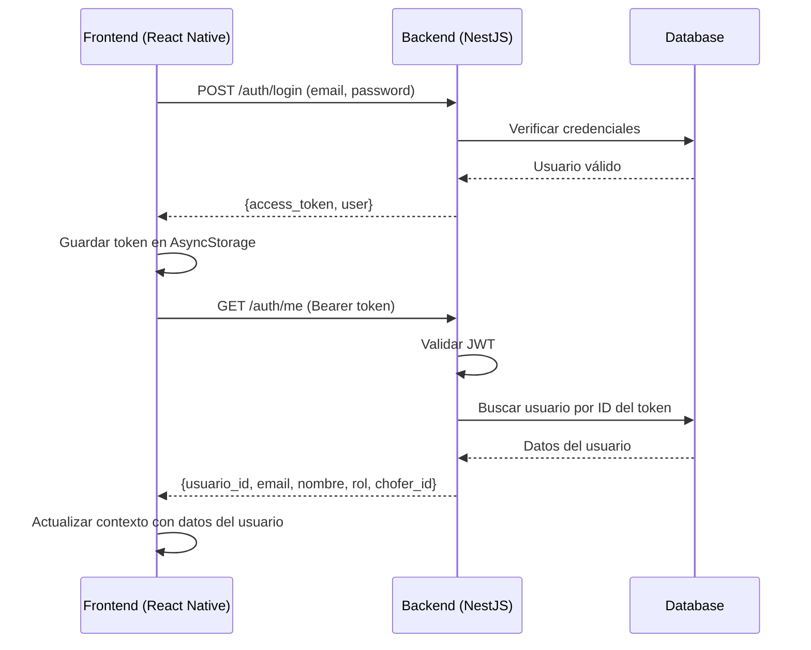

# Backend: Endpoint GET /api/v1/auth/me

## 🎯 Problema

El frontend necesita obtener los datos del usuario autenticado para mostrar el perfil correctamente. Actualmente, el `AuthContext` llama a `GET /api/v1/auth/me` después del login, pero este endpoint puede no estar implementado o no estar retornando los datos correctos.

---

## ✅ Solución: Implementar Endpoint /me

### Endpoint
```
GET /api/v1/auth/me
```

### Headers Requeridos
```
Authorization: Bearer {JWT_TOKEN}
```

### Descripción
Este endpoint retorna la información del usuario actualmente autenticado basándose en el token JWT enviado en el header `Authorization`.

---

## Implementación

### 1. Controlador (auth.controller.ts)

```typescript
import { Controller, Get, UseGuards } from '@nestjs/common';
import { AuthGuard } from '@nestjs/passport';
import { GetUser } from './decorators/get-user.decorator';
import { User } from './entities/user.entity';

@Controller('auth')
export class AuthController {
  // ... otros endpoints (login, register, forgot-password)

  @Get('me')
  @UseGuards(AuthGuard('jwt'))
  async getProfile(@GetUser() user: User) {
    return {
      usuario_id: user.usuario_id,
      email: user.email,
      nombre: user.nombre,
      rol: user.rol,
      chofer_id: user.chofer_id || null,
    };
  }
}
```

---

### 2. Decorador Personalizado (get-user.decorator.ts)

Si no existe, crear el decorador `@GetUser()`:

```typescript
import { createParamDecorator, ExecutionContext } from '@nestjs/common';

export const GetUser = createParamDecorator(
  (data: unknown, ctx: ExecutionContext) => {
    const request = ctx.switchToHttp().getRequest();
    return request.user;
  },
);
```

---

### 3. Estrategia JWT (jwt.strategy.ts)

Asegurarse de que la estrategia JWT esté configurada correctamente:

```typescript
import { Injectable, UnauthorizedException } from '@nestjs/common';
import { PassportStrategy } from '@nestjs/passport';
import { ExtractJwt, Strategy } from 'passport-jwt';
import { InjectRepository } from '@nestjs/typeorm';
import { Repository } from 'typeorm';
import { User } from './entities/user.entity';

@Injectable()
export class JwtStrategy extends PassportStrategy(Strategy) {
  constructor(
    @InjectRepository(User)
    private userRepository: Repository<User>,
  ) {
    super({
      jwtFromRequest: ExtractJwt.fromAuthHeaderAsBearerToken(),
      secretOrKey: process.env.JWT_SECRET || 'your-secret-key',
    });
  }

  async validate(payload: any) {
    const { sub: usuario_id } = payload;

    const user = await this.userRepository.findOne({
      where: { usuario_id },
      relations: ['chofer'], // Si existe relación con chofer
    });

    if (!user) {
      throw new UnauthorizedException('Token no válido');
    }

    return user;
  }
}
```

---

### 4. Configuración del Módulo (auth.module.ts)

```typescript
import { Module } from '@nestjs/common';
import { JwtModule } from '@nestjs/jwt';
import { PassportModule } from '@nestjs/passport';
import { TypeOrmModule } from '@nestjs/typeorm';
import { AuthController } from './auth.controller';
import { AuthService } from './auth.service';
import { JwtStrategy } from './jwt.strategy';
import { User } from './entities/user.entity';

@Module({
  imports: [
    TypeOrmModule.forFeature([User]),
    PassportModule.register({ defaultStrategy: 'jwt' }),
    JwtModule.register({
      secret: process.env.JWT_SECRET || 'your-secret-key',
      signOptions: {
        expiresIn: '7d', // Token válido por 7 días
      },
    }),
  ],
  controllers: [AuthController],
  providers: [AuthService, JwtStrategy],
  exports: [JwtStrategy, PassportModule],
})
export class AuthModule {}
```

---

## Response Esperado

### Éxito (200 OK) - Usuario Admin

```json
{
  "usuario_id": "550e8400-e29b-41d4-a716-446655440000",
  "email": "admin@transporte.com",
  "nombre": "Administrador del Sistema",
  "rol": "admin",
  "chofer_id": null
}
```

### Éxito (200 OK) - Usuario Chofer

```json
{
  "usuario_id": "660e8400-e29b-41d4-a716-446655440001",
  "email": "juan.perez@transporte.com",
  "nombre": "Juan Pérez González",
  "rol": "chofer",
  "chofer_id": "770e8400-e29b-41d4-a716-446655440002"
}
```

### Error (401 Unauthorized) - Token Inválido o Expirado

```json
{
  "statusCode": 401,
  "message": "Unauthorized",
  "error": "Unauthorized"
}
```

### Error (401 Unauthorized) - Token No Enviado

```json
{
  "statusCode": 401,
  "message": "Unauthorized",
  "error": "Unauthorized"
}
```

---

## Testing

### Probar con CURL

```bash
# 1. Login para obtener token
TOKEN=$(curl -X POST http://localhost:3000/api/v1/auth/login \
  -H "Content-Type: application/json" \
  -d '{
    "email": "admin@transporte.com",
    "password": "admin123"
  }' | jq -r '.access_token')

# 2. Obtener perfil del usuario
curl -X GET http://localhost:3000/api/v1/auth/me \
  -H "Authorization: Bearer $TOKEN"
```

**Respuesta esperada:**
```json
{
  "usuario_id": "550e8400-e29b-41d4-a716-446655440000",
  "email": "admin@transporte.com",
  "nombre": "Administrador del Sistema",
  "rol": "admin",
  "chofer_id": null
}
```

### Probar con token inválido

```bash
curl -X GET http://localhost:3000/api/v1/auth/me \
  -H "Authorization: Bearer token-invalido"
```

**Respuesta esperada:**
```json
{
  "statusCode": 401,
  "message": "Unauthorized"
}
```

---

## Estructura de la Entidad User

Asegúrate de que la entidad `User` tenga estos campos:

```typescript
import { Column, Entity, PrimaryGeneratedColumn, ManyToOne, JoinColumn } from 'typeorm';
import { Chofer } from '../../choferes/entities/chofer.entity';

@Entity('usuarios')
export class User {
  @PrimaryGeneratedColumn('uuid')
  usuario_id: string;

  @Column({ unique: true })
  email: string;

  @Column()
  password: string;

  @Column()
  nombre: string;

  @Column({ type: 'enum', enum: ['admin', 'chofer'], default: 'chofer' })
  rol: 'admin' | 'chofer';

  @Column({ nullable: true })
  chofer_id: string;

  @ManyToOne(() => Chofer, { nullable: true })
  @JoinColumn({ name: 'chofer_id' })
  chofer?: Chofer;

  @Column({ type: 'timestamp', default: () => 'CURRENT_TIMESTAMP' })
  creado_en: Date;

  @Column({ type: 'timestamp', default: () => 'CURRENT_TIMESTAMP', onUpdate: 'CURRENT_TIMESTAMP' })
  actualizado_en: Date;
}
```

---

## Variables de Entorno

Asegúrate de tener configurado en tu `.env`:

```env
JWT_SECRET=tu-clave-secreta-muy-segura-y-larga
JWT_EXPIRATION=7d
```

---

## Seguridad

### 1. Proteger el Endpoint

El endpoint DEBE estar protegido con `@UseGuards(AuthGuard('jwt'))` para que solo usuarios autenticados puedan acceder.

### 2. No Retornar el Password

NUNCA retornar el campo `password` en la respuesta, incluso si está hasheado.

### 3. Validar Token

La estrategia JWT debe validar:
- Que el token no esté expirado
- Que el usuario aún exista en la base de datos
- Que el usuario no haya sido deshabilitado

---

## Flujo de Autenticación Completo



---

## Checklist de Implementación

- [ ] Crear endpoint `GET /api/v1/auth/me`
- [ ] Implementar decorador `@GetUser()`
- [ ] Configurar `JwtStrategy` correctamente
- [ ] Proteger endpoint con `@UseGuards(AuthGuard('jwt'))`
- [ ] Asegurar que la entidad User tenga todos los campos necesarios
- [ ] Probar con token válido (debe retornar 200 OK con datos del usuario)
- [ ] Probar con token inválido (debe retornar 401 Unauthorized)
- [ ] Probar sin token (debe retornar 401 Unauthorized)
- [ ] Verificar que NO se retorne el campo password
- [ ] Configurar variables de entorno (JWT_SECRET)

---

## Problemas Comunes

### Error: "Cannot GET /api/v1/auth/me"

**Causa:** El endpoint no está registrado en el controlador.

**Solución:** Agregar el método `getProfile()` en `auth.controller.ts`.

### Error: "Unauthorized" con token válido

**Causa:**
- JWT_SECRET diferente entre login y validación
- JwtStrategy no configurado correctamente
- Token expirado

**Solución:**
- Verificar que JWT_SECRET sea el mismo en toda la aplicación
- Revisar configuración de `JwtStrategy`
- Generar nuevo token haciendo login nuevamente

### Error: "user is undefined" en el decorador @GetUser()

**Causa:** La estrategia JWT no está adjuntando el usuario a `request.user`.

**Solución:**
- Asegurar que `JwtStrategy.validate()` retorne el objeto user completo
- Verificar que el guard `AuthGuard('jwt')` esté aplicado

---

## Resumen

Este endpoint es crítico para el funcionamiento correcto del sistema de autenticación. Permite que el frontend:

1. Obtenga los datos del usuario después del login
2. Muestre el perfil correcto según el rol (admin/chofer)
3. Restaure la sesión al recargar la app (si el token aún es válido)

Implementar correctamente este endpoint resolverá el problema de que la pantalla de perfil muestre siempre "Administrador" sin importar quién esté logueado.